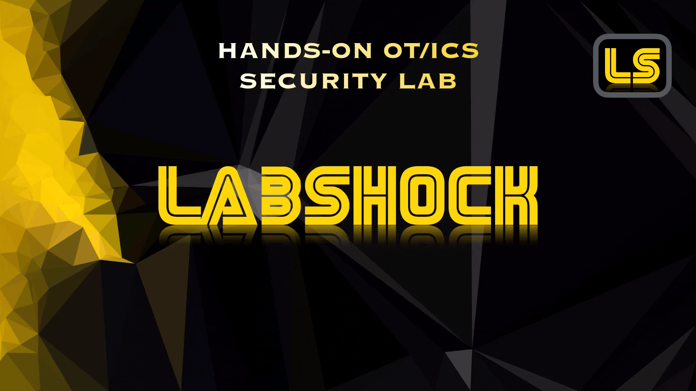
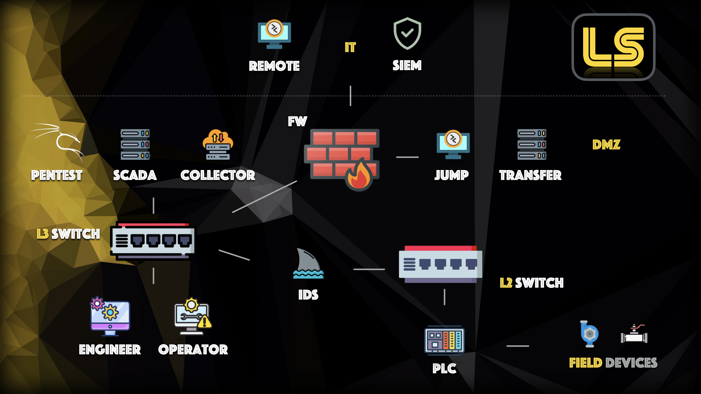
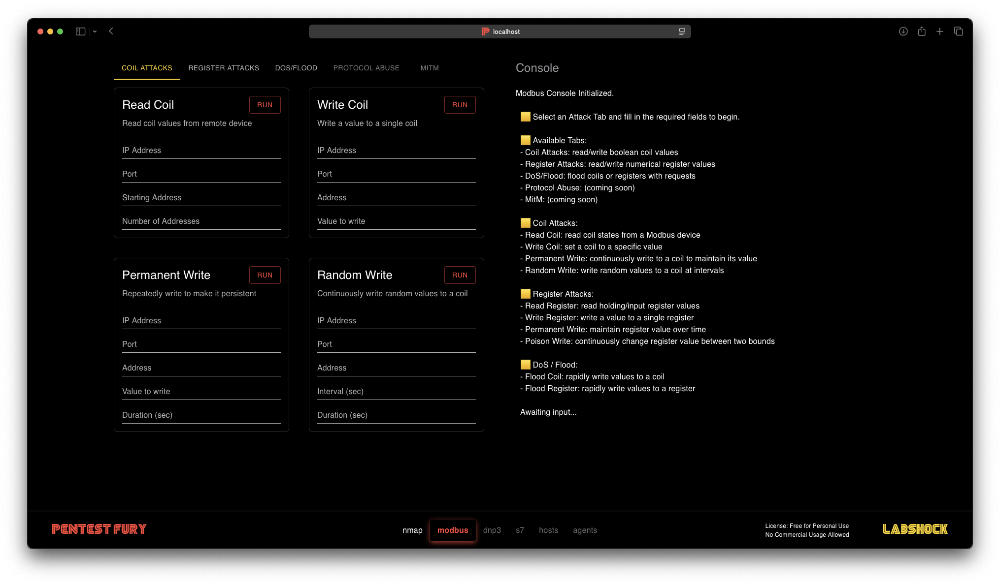
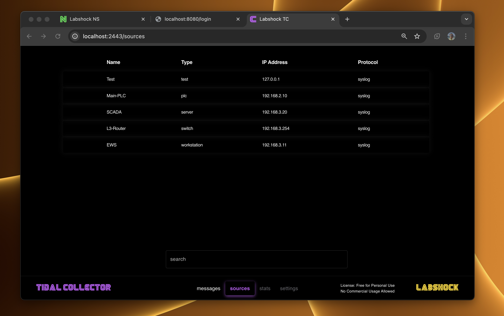

<p align="center">
  <a href="https://github.com/zakharb/labshock">
  
</p>


<br><br>
## 🟨 Labshock - #1 Industrial Cyber Lab

Labshock provides a ready-to-use environment to learn, simulate attacks and test defensive strategies.

### Why Labshock
- [check Website](https://labshock.github.io/)
- save 90% of time on setup and maintenance  
- reduce costs by 95% compared to physical testbeds
- provide safe, real-world OT environments for learning and testing

### Who is Labshock for
- [Labshock Into Video](https://youtu.be/USo6mDEdnf4)
- Universities & Mentors: create hands-on and practical OT cources  
- OT Red & Blue Teams: exploit ICS and validate OT SIEM/IDS rules
- Companies: create custom Labs and test your tools

### What You Get
- [Labshock Demo Video](https://youtu.be/Q4HBjgnCOO0)
- Build a complete ICS test lab in 5 minutes  
- Simulate SCADA & PLCs for attack/defense training  
- Capture traffic, test SIEM rules and refine IDS detection  


### Links
- [Labshock Website](https://labshock.github.io/)  
- [YouTube Channel](https://www.youtube.com/playlist?list=PLC93sRj_3EZ2Ydl1t5Kr6p4klYDLDEQUF)  
- [Support Discord](https://discord.gg/bpmaQFfW76)  
- [Linkedin Updates](https://www.linkedin.com/in/zakharb/)  

<p align="center">
  ⭐ please put Star ⭐
  <br><br>
  
</p>

<br><br>

## 🟨 Support Labshock
Help us keep Labshock growing! Your contributions support ongoing development, documentation, and community resources.

### Individual Contributions
> Support Labshock with a small donation to fund new features and maintenance.  

[](https://ko-fi.com/zakharbernhardt)

### Sponsorship & Partnerships
> Interested in sponsoring Labshock or collaborating on OT security projects?  

[](https://www.linkedin.com/in/zakharb/)
  

<br><br>
## :yellow_square: Requirements

Install [Docker](https://www.docker.com/), thats all.  
Minimal: `CPU 2` | `RAM 2G` | `HDD 10G`  
Recommended: `CPU 4` | `RAM 8G` | `HDD 20G`  

<p align="center">
  
</p>

<br><br>
## :yellow_square: Install & Update

For Instructions please check [Quickstart Guide](https://github.com/zakharb/labshock/wiki/Quickstart-Guide)  
Videos: [Linux](https://youtu.be/CGpizCGcHBc), [Windows](https://youtu.be/7PkIeSX6q6g)  


<br><br>
## :yellow_square: Services

For more info check [Wiki Documentation](https://github.com/zakharb/labshock/wiki)
 

```python
PORTAL       # Web                  # https://localhost
PLC          # OpenPLC              # http://localhost:8080
SCADA        # FUXA                 # http://localhost:1881, pwd: openplc/openplc
EWS          # Kali Linux           # http://localhost:5911/vnc.html, pwd: engineer
PENTEST      # Pentest Fury         # http://localhost:3443
IDS          # Network Swiftness    # http://localhost:1443
COLLECTOR    # Tidal Collector      # http://localhost:2443
And more...
```


<br><br>
## :yellow_square: Portal

*Labshock contains Portal as central hub for accessing all services, documentation and resources.*  

With Portal Service you can:
- access all Labshock tools from a single interface: [https://localhost](https://localhost)
- navigate directly to documentation, configuration guides
- connect to services like Network Swiftness, Tidal Collector and Pentest Fury
- use built-in links to troubleshooting and support resources

Usage:
- open web interface http://localhost
- check more info on [wiki](https://github.com/zakharb/labshock/wiki/Portal-service)

<p align="center">
  
</p>

<br><br>
## :yellow_square: PLC

*Labshock contains modified version of [OpenPLC](https://autonomylogic.com)*  
  

PLC supports all five languages defined in the IEC 61131-3 standard: 
- `LD` Ladder Logic
- `IL` Instruction List
- `ST` Structured Text
- `FBD` Function Block Diagram
- `SFC` Sequential Function Chart

PLC supports protocols
- Modbus
- DNP3
- S7 (soon)

Usage:
- login into dashboard http://localhost:8080
- user/password `openplc/openplc`
- check more info on [wiki](https://github.com/zakharb/labshock/wiki/PLC-service)
- find source code on [forkedOpenPLC](https://github.com/zakharb/OpenPLC_v3)

<p align="center">
  
</p>

<br><br>
## :yellow_square: SCADA

*Labshock contains modified version of [FUXA](https://frangoteam.org)*

SCADA supports protocols:
- Modbus RTU/TCP
- Ethernet/IP
- BACnet IP
- OPC UA
- WebAPI
- MQTT
- S7

Usage:
- login into main interface http://localhost:1881
- user/password you can set in settings
- check more info on [wiki](https://github.com/zakharb/labshock/wiki/SCADA-service)

<p align="center">
  
</p>


<br><br>
## :yellow_square: Pentest Fury

*Labshock includes Pentest Station tailored for OT and ICS security testing.*

Features:

- Tools for Modbus, DNP3, IEC 60870-5-104, S7, OPC UA analysis
- SCADA/PLC fuzzing, packet manipulation, and vulnerability scanning
- Pre-installed Kali tools like Nmap, Wireshark & Metasploit

Use Cases:
- Test OT system security and ICS networks
- Simulate attacks: replay, MITM, command injection
- Decode and analyze SCADA traffic

Usage:
- open web interface http://localhost:3443
- or use command line
```
ssh pentest@localhost -p 2222
pwd: pentest
```
- check more info on [wiki](https://github.com/zakharb/labshock/wiki/Pentest-service)
  
🔒 License:

- Pentest Fury is for personal, non-commercial use only.
- Redistribution, modification, or commercial use is prohibited.
- See [LICENSE](LICENSE) for details.
  
Ready for OT-focused pentesting.

<p align="center">
  
</p>

<br><br>
## :yellow_square: Network Swiftness

*Labshock includes Network Swiftness for real-time network monitoring and analysis in OT environments.*

Features:

- Monitor live network traffic
- Track active connections
- Detect and classify protocols
- Generate network topology maps
- Capture, analyze and save packets
- Web based: simple & easy

Use Cases:

- Gain visibility into OT network activity
- Identify unauthorized connections and protocol anomalies
- Analyze SCADA/ICS traffic patterns
- Save packet data for forensic analysis

Usage:
- open web interface http://localhost:1443
- check more info on [wiki](https://github.com/zakharb/labshock/wiki/IDS-service)

⚠️ Windows Docker Desktop Users:
- navigate to Settings > Resources > Network, and check the "Enable host networking" option.

🔒 License: 
- Network Swiftness is for personal, non-commercial use only.
- Redistribution, modification, or commercial use is prohibited.
- See [LICENSE](LICENSE) for details.

Ready for OT network monitoring and analysis.

<p align="center">
  
</p>

### External IDS

You can easily connect other IDS, for example [Zeek](https://github.com/zakharb/labshock/wiki/IDS-Service#-Zeek-IDS)

<br><br>
## :yellow_square: Tidal Collector

*Labshock includes Tidal Collector for efficient OT data collection and forwarding.*

Features:

- Collect logs and metrics from OT devices
- Normalize and forward data to SIEM
- Filter and enrich data before forwarding
- Lightweight and efficient
- Web based: simple & easy

Use Cases:

- Centralize OT data collection for analysis
- Enhance SIEM visibility with OT-specific logs
- Normalize diverse log formats
- Reduce noise with smart filtering

Usage:

- open web interface http://localhost:2443
- find more info on [wiki](https://github.com/zakharb/labshock/wiki/Collector-service)

🔒 License:

- Tidal Collector is for personal, non-commercial use only.
- Redistribution, modification, or commercial use is prohibited.
- See [LICENSE](LICENSE) for details.

Ready for OT data collection and integration.

<p align="center">  </p>

<br><br>
## :yellow_square: EWS

*Labshock contains Engineering Station for programming SCADA and PLC.*

EWS comes pre-configured and ready to use:

- IDE OpenPLC Editor
- Interface to PLC
- Interface to SCADA
- Saved PLC/SCADA projects

Usage:

- login into noVNC interface http://localhost:5911/vnc.html
- password `engineer`
- all links/projects are on Desktop
- access PLC/SCADA via browser
- access IDE via OpenPLC Editor
- check more info on [wiki](https://github.com/zakharb/labshock/wiki/EWS-service)

<p align="center">
  
</p>


<br><br>
### Windows

It's also possible to run `Windows` inside Labshock:
- check & use this github repo [dockur/windows](https://github.com/dockur/windows)
- use at your own risk & effort


<p align="center">
  
</p>


<br><br>
## :yellow_square: Versioning

Using [SemVer](http://semver.org/) for versioning. 

For the versions available, see the [tags on this repository](https://github.com/zakharb/labshock/tags). 

<br><br>
## :yellow_square: Authors

* **Zakhar Bernhardt** - *Initial work* - [Ze](https://www.linkedin.com/in/zakharb/)

See also the list of [contributors](https://github.com/zakharb/labshock/contributors) who participated in this project.

<br><br>
## :yellow_square: License

© 2025 Zakhar Bernhardt  
Labshock contains open-source and proprietary components.   
See the [LICENSE](LICENSE) file for details.  

