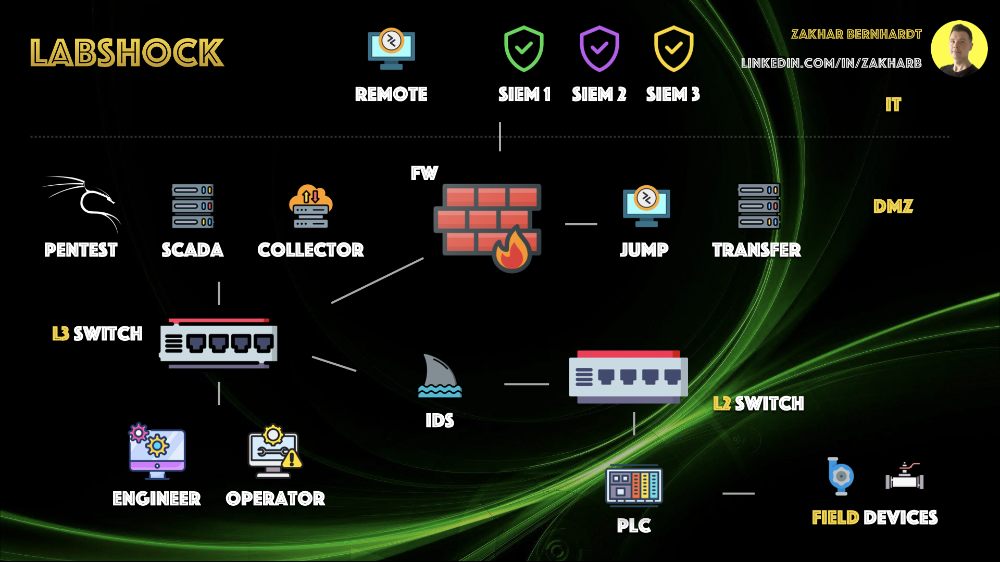
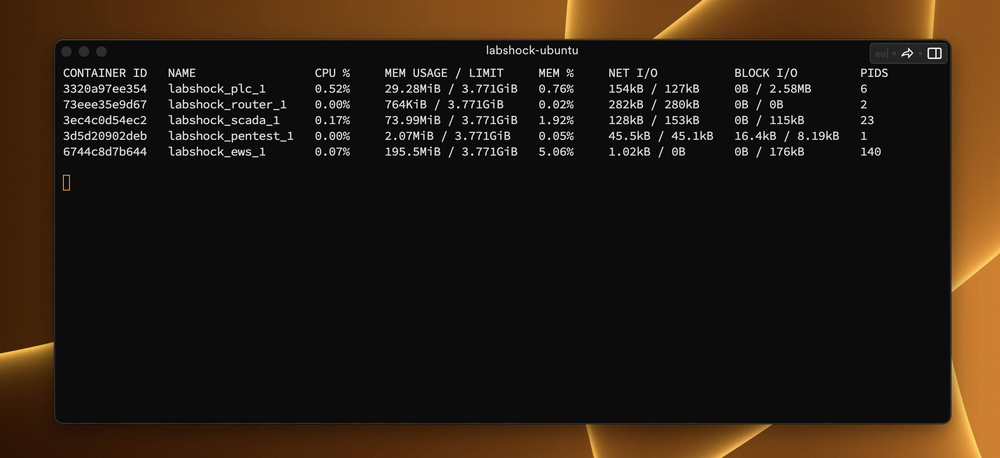
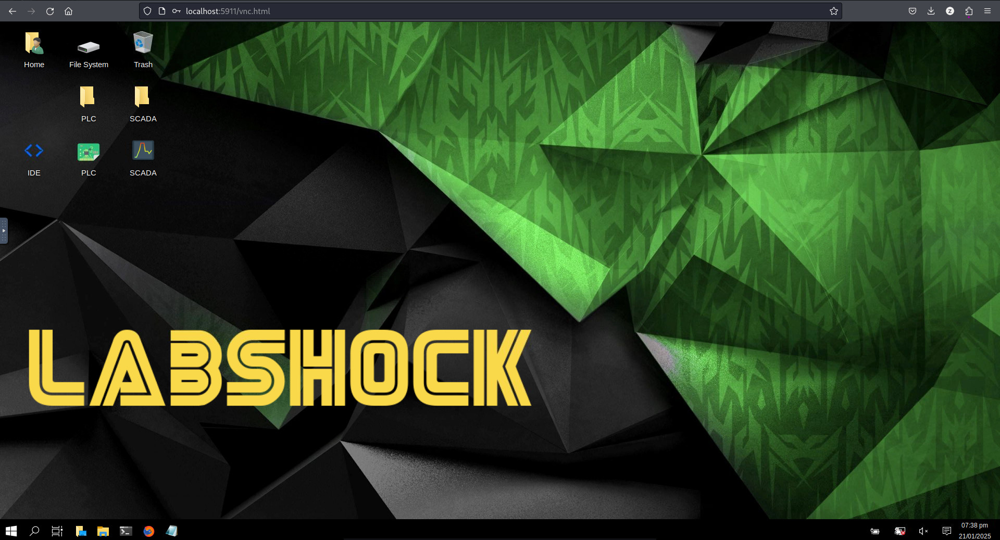

<p align="center">
  <a href="https://github.com/zakharb/labshock">
  
</p>

<p align="center">

  <a href="https://git.io/typing-svg">
    
  </a>
<p align="center">
  
  
  
  
  
  
  
  
</p>

<br><br>
## 🟨 Labshock - Your ICS Security Lab without Cost & Complexity

[Labshock](https://labshock.github.io/) lets you build and test ICS security labs - without expensive hardware.

### Why Labshock
- save 90% of time on setup and maintenance  
- reduce costs by 95% compared to physical testbeds  

### Who is Labshock for

- Security Teams > test security tools, train staff, simulate real threats  
- Universities > hands-on ICS training, SCADA/PLC setup  
- Red Team > exploit ICS systems with Pentest Fury  
- Blue Team > validate SIEM rules with Tidal Collector  
- Researchers > analyze OT traffic with Network Swiftness  

### What You Get
- Build a complete ICS test lab in 5 minutes  
- Simulate SCADA & PLCs for attack/defense training  
- Capture traffic, test SIEM rules and refine detection  

### Links
- [YouTube Channel](https://www.youtube.com/playlist?list=PLC93sRj_3EZ2Ydl1t5Kr6p4klYDLDEQUF)
- [Labshock Website](https://labshock.github.io)  
- [Wiki Documentation](https://github.com/zakharb/labshock/wiki)  
- [Quickstart Guide](https://github.com/zakharb/labshock/wiki/Quickstart-Guide)  
- [Support Discord](https://discord.gg/bpmaQFfW76)  

<p align="center">
  ⭐ If you find this project useful, please consider giving it Star ⭐
  
</p>

<br><br>
## :red_square: Support Labshock
If you find this project useful, please consider helping:

[](https://ko-fi.com/zakharbernhardt)

<br><br>
## :yellow_square: Requirements

Use [Quickstart Guide](https://github.com/zakharb/labshock/wiki/Quickstart-Guide)

Install Docker components, thats all:
- [Docker](https://www.docker.com/)
- [Docker-compose](https://docs.docker.com/compose/install/)
- [Git](https://git-scm.com/book/en/v2/Getting-Started-Installing-Git) *(optional)*


Minimal System Requirements `CPU 2` | `RAM 1G` | `HDD 10G`  

<p align="center">
  
</p>

<br><br>
## :yellow_square: Install & Run & Update

Install
 ```
git clone https://github.com/zakharb/labshock.git
cd labshock/labshock
docker-compose build
 ```

Run
```
docker-compose up
```

Update
 ```
git pull
cd labshock
docker-compose down -v
docker-compose build
```

❤️ If you install Labshock, consider supporting Labshock: [](https://ko-fi.com/zakharbernhardt)


<br><br>
## :yellow_square: Services

### What's Inside

```python
PORTAL       # Web                  # https://localhost
PLC          # OpenPLC              # http://localhost:1881
SCADA        # FUXA                 # http://localhost:8080, pwd: openplc/openplc
EWS          # Kali Linux           # http://localhost:5911/vnc.html, pwd: engineer
PENTEST      # Kali Linux           # ssh pentest@localhost -p 2222, pwd: pentest
IDS          # Network Swiftness    # http://localhost:1443
COLLECTOR    # Tidal Collector      # http://localhost:2443
And more...
```


<br><br>
## :yellow_square: Portal

*Labshock Portal serves as the central hub for accessing all Labshock services, documentation and resources.*  

With Portal Service you can:
- access all Labshock tools from a single interface: [http://localhost](http://localhost)
- navigate directly to documentation, configuration guides
- connect to services like Network Swiftness, Tidal Collector and Pentest Fury
- use built-in links to troubleshooting and support resources


<p align="center">
  
</p>

<br><br>
## :yellow_square: PLC

*Labshock contains modified version of [OpenPLC](https://autonomylogic.com)*  
Source code for service: [forkedOpenPLC](https://github.com/zakharb/OpenPLC_v3)  

PLC supports all five languages defined in the IEC 61131-3 standard: 
- `LD` Ladder Logic
- `IL` Instruction List
- `ST` Structured Text
- `FBD` Function Block Diagram
- `SFC` Sequential Function Chart

PLC supports protocols
- Modbus
- DNP3

With PLC you can:
- login into dashboard http://localhost:8080
- user/password `openplc/openplc`
- start/stop PLC
- upload project
- monitor status
- change settings

<p align="center">
  
</p>

<br><br>
## :yellow_square: SCADA

*Labshock contains modified version of [FUXA](https://frangoteam.org)*

SCADA supports protocols:
- Modbus RTU/TCP
- Ethernet/IP
- BACnet IP
- OPC UA
- WebAPI
- MQTT
- S7

With SCADA you can:
- login into main interface http://localhost:1881
- user/password you can set in settings
- interact with controls
- check alarms
- edit layout
- edit connections/tags

<p align="center">
  
</p>

<br><br>
## :yellow_square: EWS

*Labshock contains Engineering Station based on [Kali Linux](https://www.kali.org/)*

EWS comes pre-configured and ready to use:
- IDE OpenPLC Editor
- Interface to PLC
- Interface to SCADA
- Saved PLC/SCADA projects

With EWS you can:
- login into noVNC interface http://localhost:5911/vnc.html
- password `engineer`
- all links/projects are on Desktop
- access PLC/SCADA via browser
- access IDE via OpenPLC Editor

<p align="center">
  
</p>


<br><br>
### Windows

It's also possible to run `Windows` inside Labshock:
- check & use this github repo [dockur/windows](https://github.com/dockur/windows)
- use at your own risk & effort

To run inside labshock include in `docker-compose.yml` service:
```
  ews-win:
    image: dockurr/windows
    container_name: windows
    environment:
      VERSION: "11"
    devices:
      - /dev/kvm
      - /dev/net/tun
    cap_add:
      - NET_ADMIN
    ports:
      - 8006:8006
      - 3389:3389/tcp
      - 3389:3389/udp
    stop_grace_period: 2m
```

<p align="center">
  
</p>

<br><br>
## :yellow_square: Pentest

*Labshock contains modified version of [Kali Linux](https://www.kali.org/)*

Labshock includes Pentest Station tailored for OT and ICS security testing:

- Tools for Modbus, DNP3, IEC 60870-5-104, OPC UA analysis
- SCADA/PLC fuzzing, packet manipulation, and vulnerability scanning
- Pre-installed Kali tools like Nmap, Wireshark & Metasploit

Use Cases:
- Test OT system security and ICS networks
- Simulate attacks: replay, MITM, command injection
- Decode and analyze SCADA traffic

Usage:
```
ssh pentest@localhost -p 2222
pwd: pentest
```

Ready for OT-focused pentesting.

<p align="center">
  
</p>

<br><br>
## :yellow_square: Network Swiftness

Labshock includes Network Swiftness for real-time network monitoring and analysis in OT environments.

Features:

- Monitor live network traffic
- Track active connections
- Detect and classify protocols
- Generate network topology maps
- Capture, analyze and save packets
- Web based: simple & easy

Use Cases:

- Gain visibility into OT network activity
- Identify unauthorized connections and protocol anomalies
- Analyze SCADA/ICS traffic patterns
- Save packet data for forensic analysis

Usage:
- open web interface http://localhost:1443

Windows Docker Desktop Users:
- navigate to Settings > Resources > Network, and check the "Enable host networking" option.

🔒 License: 
- Network Swiftness is for personal, non-commercial use only.
- Redistribution, modification, or commercial use is prohibited.
- See [LICENSE](LICENSE) for details.

Ready for OT network monitoring and analysis.

<p align="center">
  
</p>

### External IDS

Now You cab easily connect other IDS, for example Zeek:
```
  ids:
    image: zeek/zeek:latest
    network_mode: host
    command: tail -f /dev/null
```

<br><br>
## :yellow_square: Tidal Collector

Labshock includes Tidal Collector for efficient OT data collection and forwarding.

Features:

- Collect logs and metrics from OT devices
- Normalize and forward data to SIEM
- Filter and enrich data before forwarding
- Lightweight and efficient
- Web based: simple & easy

Use Cases:

- Centralize OT data collection for analysis
- Enhance SIEM visibility with OT-specific logs
- Normalize diverse log formats
- Reduce noise with smart filtering

Usage:

- open web interface http://localhost:2443

🔒 License:

- Tidal Collector is for personal, non-commercial use only.
- Redistribution, modification, or commercial use is prohibited.
- See [LICENSE](LICENSE) for details.

Ready for OT data collection and integration.

<p align="center">  </p>

<br><br>
## :yellow_square: Versioning

Using [SemVer](http://semver.org/) for versioning. 

For the versions available, see the [tags on this repository](https://github.com/zakharb/labshock/tags). 

<br><br>
## :yellow_square: Authors

* **Zakhar Bernhardt** - *Initial work* - [Ze](https://www.linkedin.com/in/zakharb/)

See also the list of [contributors](https://github.com/zakharb/labshock/contributors) who participated in this project.

<br><br>
## :yellow_square: License

This program is free software for personal, non-commercial use only.  
See the [LICENSE](LICENSE) file for details.  

